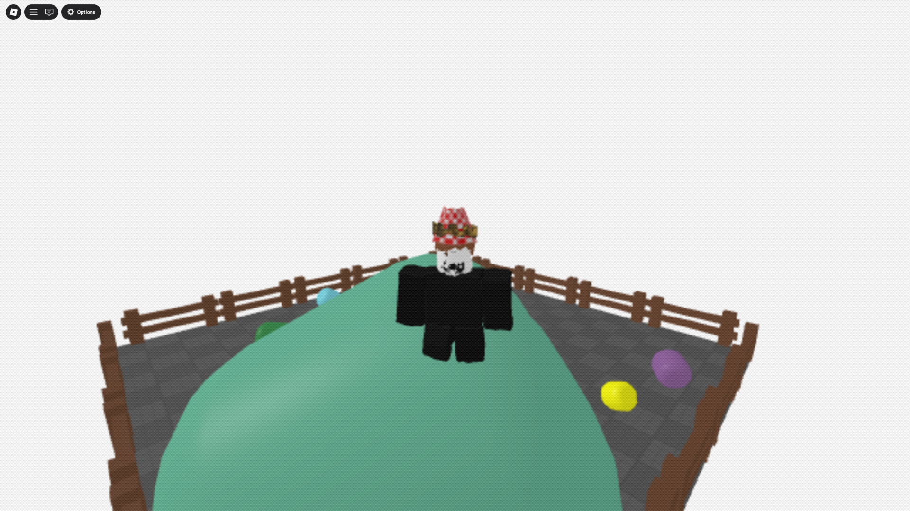

# What it does:
This model adds a PS1 effect to your Roblox game with some limitations.

[Test game (PS1 Merge!)](https://www.roblox.com/games/98847863076743/PS1-Merge)
# What it **does not** do:
Instances that affect the children of it's parent (e.g. BodyColor, Shirts, Pants, etc.) do not work. This is a limitation with the implementation. This can be fixed, I just don't have the motivation to do so.

# What it is intended for:
This model is just a proff of concept. It is not intended for a live game. It has limitations as mentioned above.

# How to use it:
1. Place "Values" in ReplicatedStorage
2. Place "RenderView" in StarterPlayer
3. Place "DitherScreenGui" in StarterGui
4. Place "RenderSurfaceGui" in StarterGui
5. Place "TagList" in ServerStorage. If you have a "TagList" folder in ServerStorage, place the tags in that folder
6. Tag everything you want to be visible to the player with the "Render" tag. Anything that you intend to never move can be tagged with the "Static" tag to save on performance.
7. You can change the resolution by changing the "VerticalResolution" IntValue in the "Values" Folder and the wobble strength by changing "WobbleStrength" in the "Values" folder.
8. Delete the PS1Effect model with this READ ME script.

If you want to apply post-processing effects, make sure that the "AlwaysOnTop" values is set to false. This can cause the effect to clip when objects are less than 0.11 studs away from the  camera.

# How it works:
The scripts creates a Part that the SurfaceGui is adorneed to. A SurfaceGui is used to lower the resolution of the screen. In the SurfaceGui there is a ViewportFrame with a WorldModel where everything with the Render tag is cloned to. Everything in the WorldModel is offset by a WobbleStrength on all axis to achieve the vertex wobble effect. The dither effect is just an image overlay that matches the resolution of the SurfaceGui. Everything is dynamic and can be changed at runtime.

# Script to setup automatically:
Run this code in the Command Bar to automatically add everything in the right place. 
**ALWAYS CHECK CODE BEFORE RUNNING IT IN STUDIO**
```lua
local InsertService = game:GetService("InsertService")
local ServerStorage = game:GetService("ServerStorage")
local ReplicatedStorage = game:GetService("ReplicatedStorage")
local StarterPlayer = game:GetService("StarterPlayer")
local StarterGui = game:GetService("StarterGui")

local insertedModel : Model = InsertService:LoadAsset(129499380745272)
local ps1EffectModel : Model = insertedModel:FindFirstChildOfClass("Model")
local tagList : Folder = ps1EffectModel:FindFirstChild("TagList")
local values : Folder = ps1EffectModel:FindFirstChild("Values")
local renderViewScript : Script = ps1EffectModel:FindFirstChild("RenderView")
local ditherScreenGui : ScreenGui = ps1EffectModel:FindFirstChild("DitherScreenGui")
local renderSurfaceGui : ScreenGui = ps1EffectModel:FindFirstChild("RenderSurfaceGui")

-- Add tags to TagList if TagList, else add tags to existing TagList in ServerStorage
if not ServerStorage:FindFirstChild("TagList") then
	tagList.Parent = ServerStorage
else
	for _, tag in tagList:GetChildren() do
		tag.Parent = ServerStorage:FindFirstChild("TagList")
	end
end

-- Add Values to ReplicatedStorage if not found, else add values to existing Values in ReplicatedStorage
if not ReplicatedStorage:FindFirstChild("Values") then
	values.Parent = ReplicatedStorage
else
	for _, value in values:GetChildren() do
		value.Parent = ReplicatedStorage:FindFirstChild("Values")
	end
end

-- Add RenderView to StarterPlayer
renderViewScript.Parent = StarterPlayer

-- Add DitherScreenGui to StarterGui
ditherScreenGui.Parent = StarterGui

-- Add RenderSurfaceGui to StarterGui
renderSurfaceGui.Parent = StarterGui

insertedModel:Destroy()
```
# Manual setup:
Use the Roblox asset: [Link to Roblox asset store (it's free)](https://create.roblox.com/store/asset/129499380745272/PS1-Effect) or download the "Setup Model" from this git.
